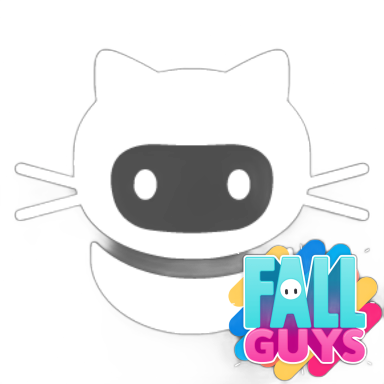

  

  
  
  
  

FallGuysIdleBot simulates keyboard inputs to start and end Fall Guys matches. This is useful for farming XP or completing quests.
Make sure you have the right game mode selected before starting the script!

## Installation

First, download this repository as a .zip folder.

### Linux 
- Python should already be installed on your computer. 

- Use the console to navigate to the FG-AFK-Bot directory, enter `pip install -r requirements.txt` to install the required packages. \
Then type `python3 FallGuysIdleBot` to start the script.

### Windows
- You need Python installed on your computer. \
Download the latest version [here](https://www.python.org/downloads/) 

- Then open Command Prompt, navigate to the FG-AFK-Bot directory and enter `python -m pip install -r requirements.txt` to install the required packages.

- Finally, open Explorer, navigate to the FG-AFK-Bot directory, then double-click `FallGuysIdleBot` to run the script.
